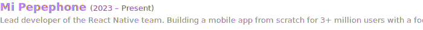
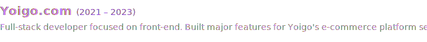
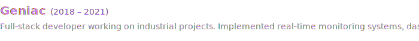
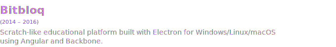

 

	

 

 

<strong>🔥 In Production · High Confidence</strong>

**💻 Languages**

**⚛️ Frameworks & Libraries**

**🧪 Testing**

**🛠️ Build & Tooling**

**☁️ Infrastructure**

<strong>🔁 Shelf Ready · Medium Confidence</strong>

**💻 Languages**

**⚛️ Frameworks & Libraries**

**🛠️ Build & Tooling**

**☁️ Infrastructure**

<strong>🧪 Exploring · Learning Curve In Progress</strong>

<strong>🗂️ Legacy · Active History</strong>

**⚛️ Frameworks & Libraries**

**🧪 Testing**

**🛠️ Build & Tooling**

 

 

  I'm passionate about technology, security, chess, and sports.  
  Would you like to collaborate on a project, discuss philosophy, or just chat about technology?  
  <strong>Schedule a conversation with me.</strong>  
  

 
