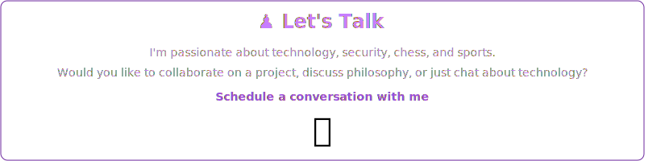

 

	

 

 

 

<strong>⚡ Current Stack · In Active Use</strong>

 

<strong>� Ready to Use · Confident & Available</strong>

 

<strong>🗂️ Legacy Stack · Production Experience</strong>

 

<strong>🧪 Learning Stack · Exploring Now</strong>

 

 

  

 
